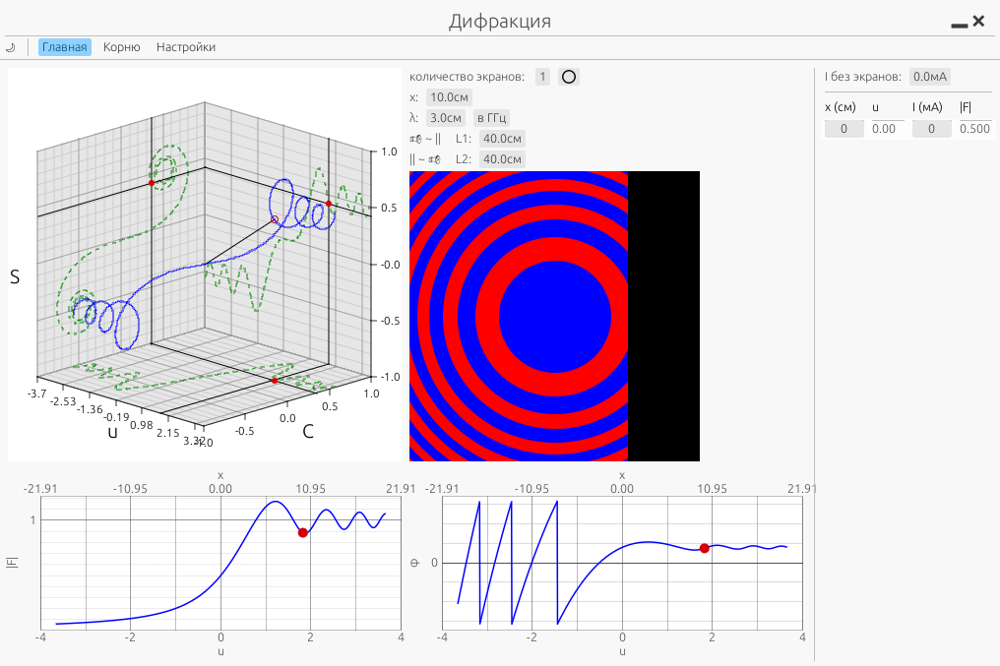

# Программа для наглядного изучении дифракции

## Техническое описание устройства программы

### 1. Библиотеки

Программа написана на Rust. Основные инструменты:

* eframe / egui — база для создания окна и кнопок.
* egui_extras — отвечает за таблицы и отображение картинок (SVG).
* egui_plot — простые графики.
* plotters + egui-plotter — связка для отрисовки сложных физических моделей: 3D-сцен, зон Френеля и спирали Корню.
* fresnel — готовая математическая функция интеграла Френеля.

### 2. Структура кода («Матрешка»)

Программа организована как набор вложенных вкладок под управлением одной оболочки:

* WrapApp (Главная оболочка): Управляет верхней панелью и переключает содержимое окна. Чтобы добавить новую вкладку, она прописывается здесь.
* Внутренние окна (Вкладки):
   1. MainApp — основной экран, где производятся расчеты параметров дифракции.
   2. DocApp — экран со спиралью Корню.
   3. Settings — настройки.

### 3. Принцип работы интерфейса (Блочная система)

Интерфейс отрисовывается в режиме Immediate Mode (каждый кадр с нуля). Главная особенность верстки заключается в использовании блочной системы:

* Сетка блоков: Интерфейс разбит на группы блоков. Каждый элемент (график, таблица, текст) забирает себе размер, равный определенной группе этих блоков.
* Геометрия: * На главном экране элементы распределяются по этим блочным группам.
   * На экране спирали Корню выделяется квадрат, размер которого привязан к высоте окна, а остальные элементы выстраиваются в колонку в оставшейся области.

### 4. Нюансы отрисовки графиков

При работе с графиками через plotters нужно учитывать следующее:

1. Ручное управление границами: Библиотека графиков (plotters) очень жадная — она пытается растянуться на всё окно. Поэтому в коде для каждого графика явно прописаны границы области, в которой он обязан сидеть. Если будете добавлять новый график, сначала выделите ему «загон».
2. Подписи осей на 3D графике: Реализованы через наложение текста поверх графика. Это «костыльное» решение, которое требует ручной подгонки переменной r при изменении маштаба графика в 'chart.with_projection'.